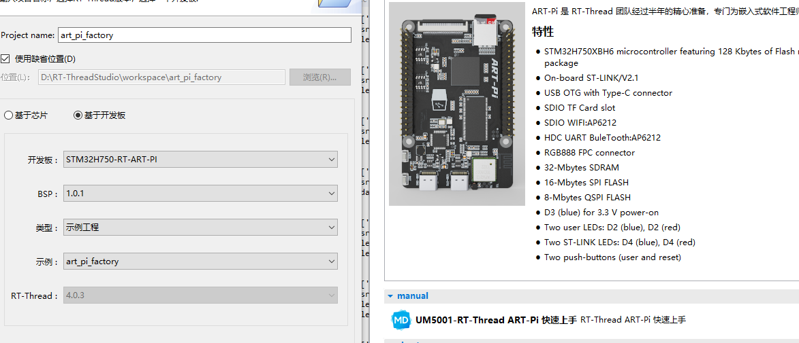
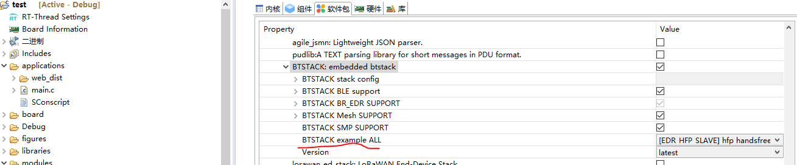

# RT-Thread_BTstack

## 介绍

BTstack 软件包是RT-Thread 基于 [btstack](https://github.com/bluekitchen/btstack) 开源蓝牙协议栈的适配，该协议栈支持多种蓝牙卡片，非常适合用于小型嵌入式蓝牙设备，支持几乎所有的主流的蓝牙卡片，支持无RTOS操作。

## 主要支持的Profile和Protocol

**Protocols:** L2CAP (incl. LE Data Channels), RFCOMM, SDP, BNEP, AVDTP, AVCTP, ATT, SM (incl. LE Secure Connections).

**Profiles:** GAP, IOP, HFP, HSP, SPP, PAN, A2DP, AVRCP incl. Browsing, GATT.

**GATT Services:** Battery, Cycling Power, Cycling Speed and Cadence, Device Information, Heart Rate, HID over GATT (HOG), Mesh Provisioning, Mesh Proxy, Nordic SPP, u-Blox SPP. 

GATT Services are in general easy to implement and require short development time. For more GATT Services please contact us, or follow the [implementation guidelines](https://bluekitchen-gmbh.com/btstack/profiles/#gatt-generic-attribute-profile).  

###  许可声明

BTstack 非商业用途是免费的。但是，对于商业用途，<a href="mailto:contact@bluekitchen-gmbh.com">请联系BTstack官方</a>关于你的项目以获得商业合作。

## 注意事项

​        BTstack支持很多蓝牙卡片，目前在RT-thread系统上，只支持AP6212卡片（基于ART-H750开发板），后续会支持更多蓝牙卡片。

## 目录结构

本目录基本参考 [btstack](https://github.com/bluekitchen/btstack)的目录创建，适配的代码放在rtt_adapter上面，其余代码基本和源BTstack代码一致，如需更新可以自行从github上更新

```
BTstack
   ├───chipset                   /* Bluetooth control adapter */
   │   ├───bcm                   /* Bluetooth control AP6212(BCM) adapter */
   ├───docs                      /* Markdown about*/
   ├───example                   /* bt stack exampl about*/
   ├───platform
   │   ├───posix                 /* btstack posix api  */
   ├───port
   │   ├───posix-h4-bcm          /* btstack posix port  */
   ├───rtt_adapter               /* the different code about the example */
   └───src                       /* btstack source code */
```

## 联系方式 & 感谢

- 维护：supperthomas
- 主页：https://github.com/supperthomas/RTT_PACKAGE_BTSTACK


## 如何使用

目前版本只支持ART-PI，请先查看ART-PI的主页熟悉ART-PI的使用方法：

官方主页 [ART-PI](https://art-pi.gitee.io/website)

step1: 熟悉RT-STUDIO中的art_pi_factory使用方法：



step2：

将btstack的软件包更新到本项目的最新代码

step3：

在软件包目录btstack中选择想要运行的example



编译完成即可：

目前支持的example：

HFP、classic、mesh、ble

```
如果发现蓝牙搜索不到，可以尝试将wifi_init();先注释掉
```


后续会持续支持中，如果有好的建议和需求，欢迎PR代码。